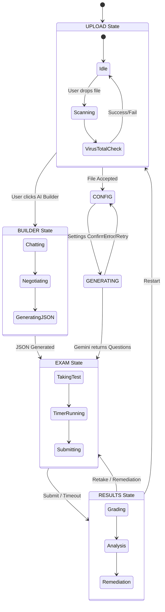

# 01. Architecture & Technology Stack

## 🏗️ System Overview

**Z+ Terminal Exam Gen** is a high-performance **Client-Side Single Page Application (SPA)** built with React 19. It is designed to be "Serverless" in the sense that it relies on the client's browser for processing and Google's Gemini API for intelligence, without an intermediate backend database for session storage.

### Core Philosophy
1.  **Stateless Logic:** The backend (Gemini) provides intelligence on demand; the state is held transiently in the React Client.
2.  **Persistence Strategy:** `localStorage` is used for the "Library" and "Leaderboard" to persist data across reloads without requiring user authentication.
3.  **Mobile-First Design:** The UI structure (seen in `Layout.tsx` and `ExamBuilder.tsx`) prioritizes touch targets, safe areas, and responsive constraints.

---

## 📂 Project Structure

```ascii
terminal-exam-gen/
├── components/          # UI Components
│   ├── AiHelper.tsx     # Floating Support Bot
│   ├── CodeWindow.tsx   # PrismJS Wrapper
│   ├── ExamBuilder.tsx  # Chat Interface
│   ├── ExamRunner.tsx   # Core Testing Engine
│   └── ...
├── services/            # Business Logic & API Calls
│   ├── gemini.ts        # Gemini API Integration (Prompts & Schema)
│   └── library.ts       # LocalStorage Wrapper
├── utils/               # Helper Functions
│   ├── fileValidation.ts # Magic Byte detection
│   ├── pdfGenerator.ts   # pdfMake configuration
│   ├── security.ts       # Input sanitization
│   └── virusTotal.ts     # Security scanning
├── types.ts             # TypeScript Interfaces (Question, ExamSettings)
└── App.tsx              # Main State Machine
```

---

## 🔄 State Management (Finite State Machine)

The application flow is strictly controlled by the `appState` variable in `App.tsx`. This ensures the user cannot be in an undefined state (e.g., trying to grade an exam that hasn't started).



### Component Hierarchy & Data Flow

*   **App.tsx (Root):** Holds the "Truth" (`questions`, `userAnswers`, `uploadedFiles`).
*   **Props Drilling:** Data is passed down to:
    *   `ExamRunner`: Receives `questions`, manages local `currentIndex` and `timer`.
    *   `Results`: Receives `userAnswers`, calculates scores, triggers `gemini.ts` for grading.

---

## 🛠️ Technology Stack Deep Dive

### 1. Frontend Framework
*   **React 19:** Utilizes the latest concurrent features.
    *   **Hooks:** Extensive use of `useRef` for scrolling/focus management and `useEffect` for lifecycle events (timers, external script loading).
    *   **Memoization:** `React.memo` is used in `MarkdownRenderer` to prevent expensive MathJax re-rendering on every timer tick.

### 2. AI Integration
*   **Google GenAI SDK (`@google/genai`):**
    *   **Model:** `gemini-2.5-flash` (Chosen for speed and low latency).
    *   **Features Used:** `generateContent`, `responseSchema` (JSON enforcement), and `systemInstruction`.

### 3. Rendering Engine
*   **Visuals:**
    *   **PDF.js:** Used for rendering PDF pages to HTML Canvas for coordinate-based cropping.
    *   **Function Plot:** D3-based library for interactive math graphs ($y=x^2$).
    *   **Mermaid.js:** Renders text-based diagrams (UML, Flowcharts) dynamically.
*   **Typography:**
    *   **MathJax 3:** Renders LaTeX equations. Configured specifically to handle RTL (Arabic) math context isolation.
    *   **PrismJS:** Syntax highlighting for code blocks.

### 4. Persistence & Output
*   **jsPDF / pdfMake:** Generates client-side PDF reports.
*   **LocalStorage:** Stores:
    *   `zplus_question_library`: JSON array of individual saved questions.
    *   `zplus_exam_library`: JSON array of full exam snapshots.
    *   `exam_leaderboard`: High scores.

---

## ⚡ Performance Considerations

1.  **Lazy Loading:** Heavy libraries (PDF.js worker) are loaded only when required via CDN injection or dynamic imports.
2.  **Debouncing:** Input fields in `ExamBuilder` and `AiHelper` are sanitized and debounced to prevent render thrashing.
3.  **Virtual DOM Optimization:** The `ExamRunner` only renders the *current* question to the DOM to keep the footprint light, even for 50+ question exams.
