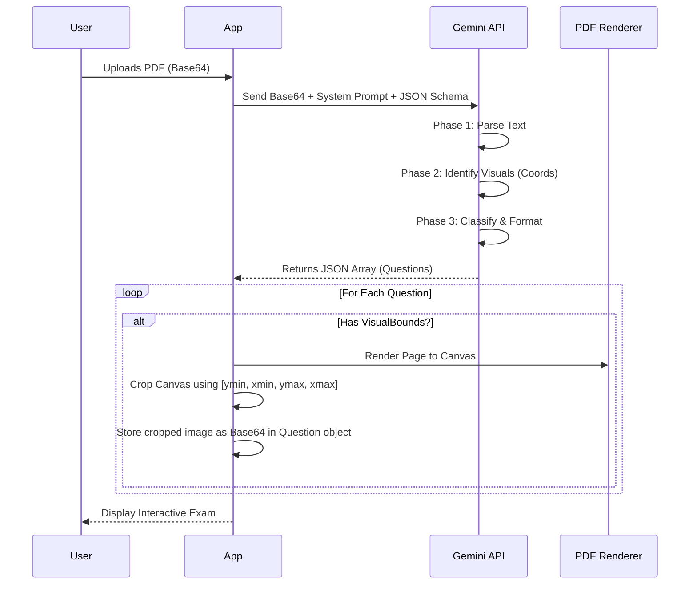

# 02. AI Generation Engine (`services/gemini.ts`)

The intelligence core of Z+ is located in `services/gemini.ts`. It transforms unstructured data (PDFs/Images) into strictly typed JSON data suitable for the application.

## 🧠 The Pipeline

The generation process follows a linear pipeline:



---

## 1. Prompt Engineering Strategy

We use a **Phased System Instruction** to ensure high-fidelity output. The prompt is constructed dynamically based on the user's `QuestionFormatPreference` and `OutputLanguage`.

### Phase Breakdown

*   **Phase 0: Sanitization (Anti-Spoiler)**
    *   *Goal:* Prevent the AI from including the answer *in* the question text.
    *   *Instruction:* "Detect if the source text includes the solution immediately after the question... REMOVE the solution text... Place it into 'explanation'."

*   **Phase 1: High-Fidelity Parsing**
    *   *Goal:* Clean data extraction.
    *   *Instruction:* "Remove 'Q1', '[5 pts]', page numbers. Convert math to LaTeX."

*   **Phase 2: Visual & Layout Analysis**
    *   *Goal:* Distinguish between "Static Images" and "Dynamic Concepts".
    *   *Logic:*
        *   **Math Graph:** Request `graphConfig` (JSON) $\rightarrow$ Renders interactive D3 plot.
        *   **UML/Logic:** Request `diagramConfig` (Mermaid Code) $\rightarrow$ Renders scalable SVG.
        *   **Generic Image:** Request `visualBounds` (Coordinates) $\rightarrow$ Client-side crop.

*   **Phase 3: Classification**
    *   *Types:* `MCQ`, `TRACING`, `CODING`, `SHORT_ANSWER`.

---

## 2. Structured Output (JSON Schema)

We leverage Gemini's `responseSchema` to guarantee the API returns data that matches our TypeScript interfaces exactly. This eliminates 99% of JSON parsing errors.

### Schema Definition (Simplified)

```typescript
const schema = {
  type: Type.ARRAY,
  items: {
    type: Type.OBJECT,
    properties: {
      id: { type: Type.STRING },
      type: { type: Type.STRING, enum: ["MCQ", "CODING", "TRACING", "SHORT_ANSWER"] },
      text: { type: Type.STRING },
      options: { type: Type.ARRAY, nullable: true }, // Required for MCQ
      // Dynamic Visuals
      graphConfig: { 
          type: Type.OBJECT, 
          properties: { functions: { type: Type.ARRAY } } 
      },
      // Coordinate System
      visualBounds: { 
          type: Type.ARRAY, 
          items: { type: Type.INTEGER },
          description: "[ymin, xmin, ymax, xmax] (0-1000 scale)"
      }
    }
  }
}
```

---

## 3. Visual Processing & Coordinate System

This is a critical feature that allows Z+ to "extract" images from PDFs without using a heavy backend OCR library.

1.  **Normalization:** The AI is instructed to view the page on a **1000x1000** coordinate grid.
2.  **Detection:** It returns bounds: `[ymin, xmin, ymax, xmax]`.
3.  **Client-Side Crop Logic (`cropImage` function):**

$$
X_{pixel} = \frac{X_{ai\_coord}}{1000} \times Canvas_{width}
$$

$$
Y_{pixel} = \frac{Y_{ai\_coord}}{1000} \times Canvas_{height}
$$

The app then creates a temporary HTML `<canvas>`, draws the PDF page onto it, and uses `ctx.drawImage` with the calculated pixel coordinates to extract *only* the relevant figure.

---

## 4. The Exam Builder (Chat Agent)

The `ExamBuilder` uses a separate prompt flow designed for negotiation.

1.  **Conversational History:** Each message is appended to a history array passed to `ai.chats.create()`.
2.  **Suggestion Engine:** The prompt instructs Gemini to append `||SUGGESTIONS|| ["Option A", "Option B"]` at the end of every reply. The UI parses this separator to create clickable "Quick Reply" chips.
3.  **Override Signal:** When the user clicks "Generate", the app sends a hidden system message: `SYSTEM OVERRIDE: Generate JSON now`. This forces the model to switch from "Chat Persona" to "Data Generation Mode".
