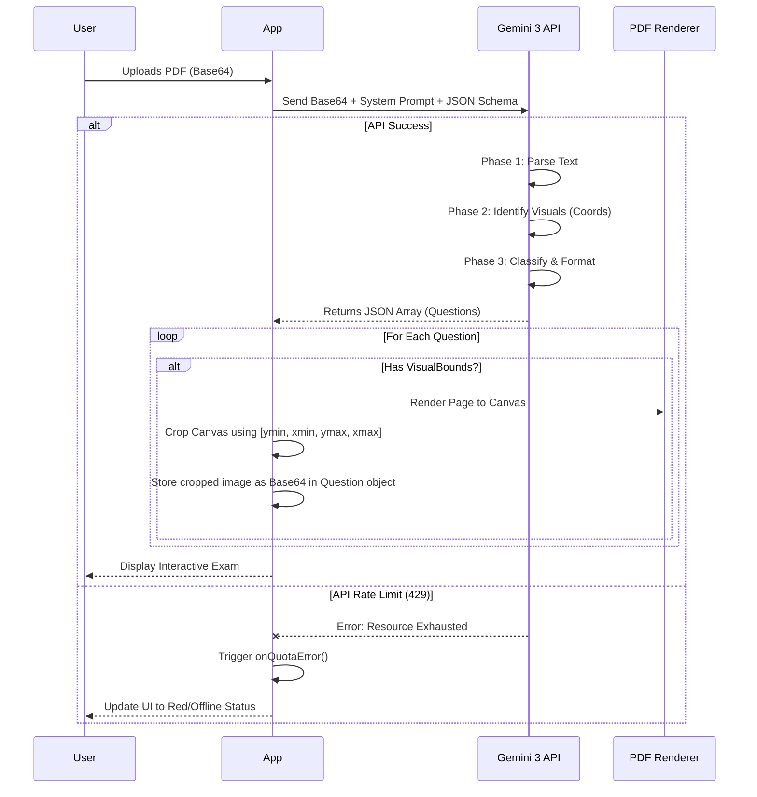

# 02. AI Generation Engine (`services/gemini.ts`)

The intelligence core of Z+ is located in `services/gemini.ts`. It transforms unstructured data (PDFs/Images) into strictly typed JSON data suitable for the application using Google's latest **Gemini 3** models.

## 🧠 The Pipeline

The generation process follows a linear pipeline:



---

## 1. Prompt Engineering Strategy

We use a **Phased System Instruction** to ensure high-fidelity output. The prompt is constructed dynamically based on the user's `QuestionFormatPreference` and `OutputLanguage`.

### Phase Breakdown

*   **Phase 0: Sanitization (Anti-Spoiler)**
    *   *Goal:* Prevent the AI from including the answer *in* the question text.
    *   *Instruction:* "Detect if the source text includes the solution immediately after the question... REMOVE the solution text... Place it into 'explanation'."

*   **Phase 1: High-Fidelity Parsing**
    *   *Goal:* Clean data extraction.
    *   *Instruction:* "Remove 'Q1', '[5 pts]', page numbers. Convert math to LaTeX."

*   **Phase 2: Visual & Layout Analysis**
    *   *Goal:* Distinguish between "Static Images" and "Dynamic Concepts".
    *   *Logic:*
        *   **Math Graph:** Request `graphConfig` (JSON) $\rightarrow$ Renders interactive D3 plot.
        *   **UML/Logic:** Request `diagramConfig` (Mermaid Code) $\rightarrow$ Renders scalable SVG.
        *   **Generic Image:** Request `visualBounds` (Coordinates) $\rightarrow$ Client-side crop.

*   **Phase 3: Classification**
    *   *Types:* `MCQ`, `TRACING`, `CODING`, `SHORT_ANSWER`.

---

## 2. Structured Output (JSON Schema)

We leverage Gemini's `responseSchema` to guarantee the API returns data that matches our TypeScript interfaces exactly. This eliminates 99% of JSON parsing errors. We use the `gemini-3-pro-preview` model for this task due to its superior adherence to complex schemas.

### Schema Definition (Simplified)

```typescript
const schema = {
  type: Type.ARRAY,
  items: {
    type: Type.OBJECT,
    properties: {
      id: { type: Type.STRING },
      type: { type: Type.STRING, enum: ["MCQ", "CODING", "TRACING", "SHORT_ANSWER"] },
      text: { type: Type.STRING },
      options: { type: Type.ARRAY, nullable: true }, // Required for MCQ
      // Dynamic Visuals
      graphConfig: { 
          type: Type.OBJECT, 
          properties: { functions: { type: Type.ARRAY } } 
      },
      diagramConfig: {
          type: Type.OBJECT,
          properties: { code: { type: Type.STRING } }
      }
    }
  }
}
```

---

## 3. Models Used

Z+ uses a tiered model strategy to balance cost, speed, and intelligence:

| Task | Model | Reason |
| :--- | :--- | :--- |
| **Exam Generation** | `gemini-3-pro-preview` | Requires high reasoning for complex documents and strict JSON schema adherence. |
| **Chat Builder** | `gemini-3-flash-preview` | Fast response times for conversational interface. |
| **Grading** | `gemini-3-flash-preview` | Speed is critical when grading multiple questions in parallel. |
| **Final Compilation** | `gemini-3-pro-preview` | Ensures the final JSON output from the Chat Builder is robust. |

---

## 4. The Exam Builder (Chat Agent)

The `ExamBuilder` uses a separate prompt flow designed for negotiation.

1.  **Conversational History:** Each message is appended to a history array passed to `ai.models.generateContent` (simulating chat history manually for stateless control).
2.  **Suggestion Engine:** The prompt instructs Gemini to append `||SUGGESTIONS|| ["Option A", "Option B"]` at the end of every reply. The UI parses this separator to create clickable "Quick Reply" chips.
3.  **Override Signal:** When the user clicks "Generate", the app calls `generateExamFromBuilderChat` which summarizes the conversation history into a structured exam JSON.

### Error Propagation & Quota Management

To maintain system stability, the Exam Builder is tightly integrated with the global `SystemStatus` state in `App.tsx`.

1.  **Error Interception:** If the Gemini API returns a `429` (Quota Exceeded) error during a chat turn or final compilation, the `gemini.ts` service detects the error.
2.  **Standardized Exception:** Instead of throwing a generic `Error`, it throws a specific string: `"429_RATE_LIMIT"`.
3.  **Global Lock:** The `ExamBuilder.tsx` component catches this specific exception and invokes the `onQuotaError()` callback.
4.  **UI Update:** This changes the top bar status from **ONLINE (Green)** to **QUOTA LIMIT (Red)**, alerting the user to wait before attempting further interactions.
