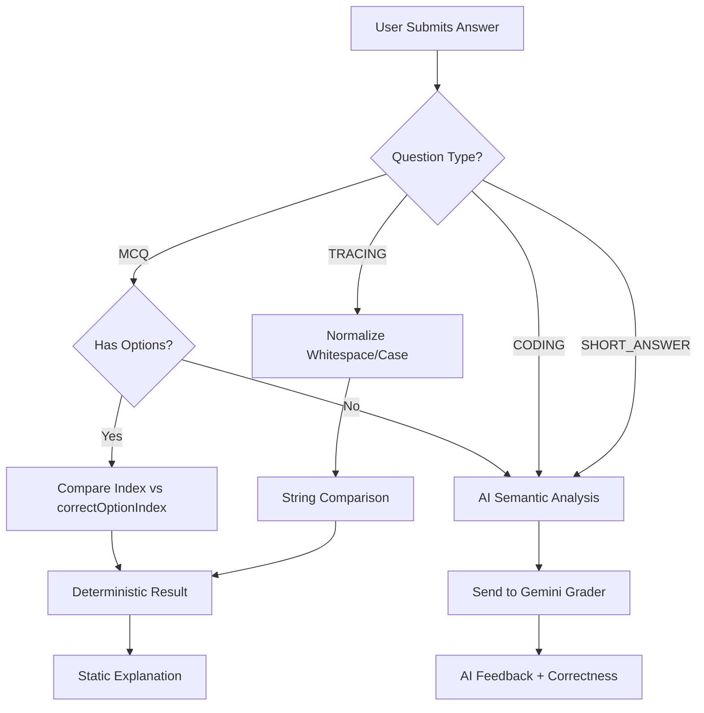

# 05. Grading Logic

Grading in Z+ is a hybrid system: **Deterministic** for objective questions and **Semantic (AI-Based)** for subjective questions.

## ⚖️ Grading Decision Tree



---

## 1. Deterministic Grading (Client-Side)

Used for Standard **MCQ** and **Tracing**.
*   **Speed:** < 10ms.
*   **Validation:**
    *   **MCQ:** `userAnswer === question.correctOptionIndex`.
    *   **Tracing:** `userString.trim().toLowerCase() === expectedString.trim().toLowerCase()`.

---

## 2. AI Semantic Grading (`services/gemini.ts`)

Used for **Coding** and **Short Answer**. This solves the issue where `x = x + 1` and `x += 1` are functionally identical but string-distinct.

### The "Grader" Prompt
We send the following package to Gemini:
1.  **Question Text**
2.  **Ideal Solution** (from the original generation phase)
3.  **User's Submission**
4.  **Constraints:** "Ignore spelling errors. Check for functional correctness. Provide feedback in [User Language]."

### Grading Output JSON
The AI returns a structured object:
```json
{
  "isCorrect": true,
  "feedback": "Correct. You used the efficient O(n) approach. However, consider handling edge case X..."
}
```

---

## 3. Weak Point Analysis & Remediation

When an exam is finished, the system performs an aggregated analysis.

### Analysis Loop (`Results.tsx`)
1.  Iterate through `answers`.
2.  If `!isCorrect`, extract `question.topic` (e.g., "Recursion").
3.  Update frequency map: `Map<Topic, FailCount>`.
4.  **Resource Matching:**
    *   Check if topic exists in the curated `RESOURCES` dictionary.
    *   If not, generate a dynamic YouTube/Google Search URL based on the topic + language (e.g., "Recursion explanation Arabic").

### Remediation Exam
The user can click **"Remediate"**.
1.  App collects IDs of all wrong answers.
2.  Sends the *original failed questions* back to Gemini.
3.  **Instruction:** "The user failed these questions. Generate NEW questions that test the *same underlying concepts* but with different values or context to reinforce learning."
4.  The result is a targeted "Micro-Exam" focusing solely on weak points.
